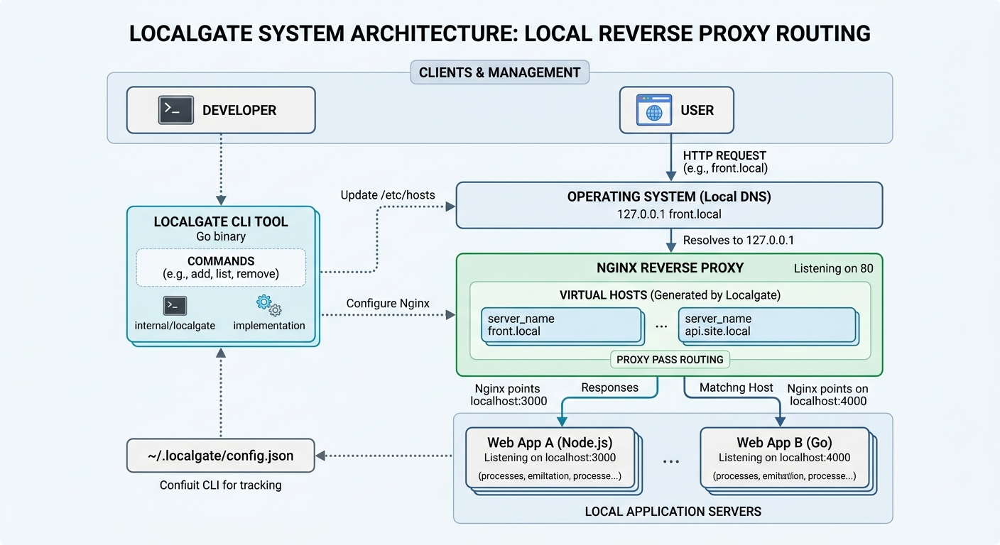

# Localgate

Localgate é uma CLI escrita em Go para criar domínios `.local` para
aplicações de desenvolvimento.

Cada rota gera um virtual host no Nginx que encaminha o tráfego para uma porta
local.

## Como funciona



O projeto atua em três frentes principais:

1. **Resolução DNS local:** modifica o `/etc/hosts` para que domínios
   `.local` apontem para `127.0.0.1`.
2. **Proxy reverso:** intercepta a requisição na porta `80` (HTTP).
3. **Roteamento:** lê o cabeçalho HTTP da requisição e repassa o tráfego para
   a porta correta da aplicação, por exemplo, `3000`.

## Funcionalidades

- Cria entradas em `/etc/hosts` e virtual hosts no Nginx.
- Valida a configuração com `nginx -t` antes de recarregar o serviço.
- Aceita nomes com subdomínios, como `api.site`.
- Mantém as rotas do Localgate em `~/.localgate/config.json`.

## Instalação no Linux

### Pré-requisitos

- [Go](https://go.dev/doc/install) versão 1.22 ou superior.
- Nginx instalado e com os diretórios `/etc/nginx/sites-available` e
  `/etc/nginx/sites-enabled` configurados.

### Instalar Go

No Ubuntu, Debian e derivados:

```bash
sudo apt update
sudo apt install -y golang-go
```

Verifique a instalação:

```bash
go version
```

Se a versão disponível no repositório da sua distribuição for antiga, instale
pelo pacote oficial em <https://go.dev/doc/install>.

### Instalar Nginx

No Ubuntu, Debian e derivados:

```bash
sudo apt update
sudo apt install -y nginx
```

Garanta que os diretórios usados pelo Localgate existam:

```bash
sudo mkdir -p /etc/nginx/sites-available /etc/nginx/sites-enabled
```

### Compilar e instalar localmente

1. Clone o repositório e acesse o diretório do projeto:

   ```bash
   git clone https://github.com/brunoribeiro-lab/local-gate
   cd local-gate
   ```

2. Baixe e organize as dependências do Go:

   ```bash
   go mod tidy
   ```

3. Compile o binário do projeto:

   ```bash
   go build -o localgate ./cmd/localgate
   ```

4. Mova o binário gerado para uma pasta disponível no `PATH`:

   ```bash
   sudo mv localgate /usr/local/bin/
   ```

5. Verifique se a CLI está disponível:

   ```bash
   localgate help
   ```

---

## Uso

O fluxo básico consiste em adicionar rotas.

O Localgate cria e habilita um virtual host do Nginx para cada domínio
configurado.

### Adicionar domínios

Informe o nome sem `.local` e a porta em que a aplicação está sendo executada:

```bash
sudo localgate add front 3000
sudo localgate add api 4000
```

Isso cria `front.local` apontando para `localhost:3000` e `api.local`
apontando para `localhost:4000`.

Depois, acesse no navegador:

- `http://front.local`
- `http://api.local`

### Outros comandos

**Listar domínios configurados:**

```bash
localgate list
```

**Remover um domínio:**

```bash
sudo localgate remove front
```

Também é possível usar o alias curto:

```bash
sudo localgate del front
```

**Exibir ajuda:**

```bash
localgate help
```

---

## Arquitetura

O executável fica em `cmd/localgate/main.go`.

A implementação fica em `internal/localgate`:

- `app.go` trata os argumentos e a saída da CLI.
- `routes.go` coordena o cadastro das rotas.
- `storage.go` administra a configuração e as entradas de hosts.
- `nginx.go` administra os virtual hosts.

Essa separação permite testar os comandos sem escrever diretamente em `/etc`
nem iniciar o Nginx durante os testes unitários.

## Sobre o `go.mod`

`go.mod` é o arquivo padrão do Go para declarar um módulo.

O comando `go` procura esse arquivo automaticamente para identificar o módulo
e suas dependências.

A linha abaixo define o nome do módulo usado pelos imports internos do projeto:

```text
module localgate
```

## Build e testes com Docker

O `Dockerfile` usa múltiplos estágios para validar o README, executar os
testes, compilar o binário Go e produzir uma imagem final reduzida.

### Compilar o binário na raiz com Docker Compose

Este comando usa um volume para montar o diretório atual dentro do container.
O binário `localgate` será gravado na raiz do projeto:

```bash
docker compose run --rm build
```

Se o seu usuário no Linux não usa o UID/GID `1000`, informe os valores ao
executar:

```bash
LOCAL_UID="$(id -u)" LOCAL_GID="$(id -g)" docker compose run --rm build
```

Depois, instale o binário em uma pasta disponível no `PATH`:

```bash
sudo install -m 0755 ./localgate /usr/local/bin/localgate
```

Para executar os testes pelo Compose:

```bash
docker compose run --rm test
```

### Validar somente o README

```bash
docker build --target readme-check -t localgate-readme-check .
```

### Executar os testes Go

```bash
docker build --target test -t localgate-test .
```

### Compilar o binário dentro do container

```bash
docker build --target builder -t localgate-builder .
```

Para copiar o binário compilado para uma pasta local:

```bash
docker build --target binary --output type=local,dest=./dist .
```

O executável será criado em `dist/localgate`.

Para instalar o binário gerado via Docker em uma pasta disponível no `PATH`:

```bash
sudo install -m 0755 ./dist/localgate /usr/local/bin/localgate
```

### Criar a imagem final

```bash
docker build -t localgate:latest .
```

Também é possível informar metadados do build:

```bash
docker build \
  --build-arg VERSION=1.0.0 \
  --build-arg COMMIT="$(git rev-parse --short HEAD)" \
  --build-arg BUILD_DATE="$(date -u +%Y-%m-%dT%H:%M:%SZ)" \
  -t localgate:1.0.0 .
```

### Executar a CLI

```bash
docker run --rm localgate:latest help
```

> O Localgate altera o `/etc/hosts` e a configuração do Nginx do sistema
> hospedeiro. A execução isolada no container serve principalmente para
> validar o binário. Para administrar o host a partir de um container, seria
> necessário montar explicitamente os arquivos e diretórios do host, o que
> deve ser feito com cuidado.
